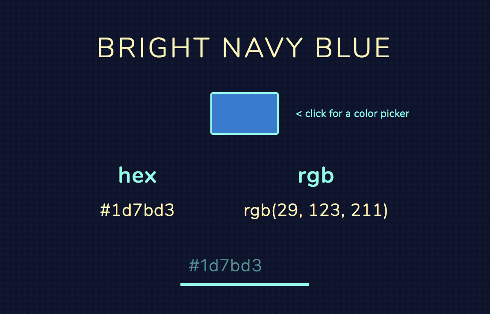

# Color namer

>"Naming colors has never been this easy!"
> \- **_Abraham Lincoln_**

A [web app](https://colornamer.robertcooper.me/) that provides a name for a color. EZPZ.

## Key Features``
- Over 30,000 color names ⚡️
- Accepts both hex and rgb formats 🎨
- Color picker 🏹

## Example

If you enter **#fb8a70**, you'll receive the name of **SALMON NIGIRI** along with the hex and rgb color representations, which would be **#fb8a70** and **rgb(251, 138, 112)**, respectively.

You might be asking yourself, _"What is SALMON NIGIRI"_?

My answer: _"
Who the hell knows? 🤷‍"_

## Accepted Color formats:

- hex with hash (e.g. **#323** or **#332233**)
- hex without hash (e.g. **323** or **332233**)
- rgb (e.g. **rgb(103, 33, 158)**)
- supported CSS color names (e.g. **red**)

## Dependencies
- **[nearest-color](https://github.com/dtao/nearest-color)** - Utility to find nearest matching color 
- **[tinycolor2](https://github.com/bgrins/TinyColor)** - Color manipulation and conversion 
- **[color-names](https://github.com/meodai/color-names)** - List of 15,000+ color names accessible through their API
- **[jscolor-picker](http://jscolor.com/)** - A color picker used when the browser doesn't support the native color picker display with `input[type='color']`

## Inspirations + Contributions
- **[David Aerne](https://twitter.com/meodai)** - Maintains the API for all the color names and has even contributed to the web app itself!
- **[Name That Color](http://chir.ag/projects/name-that-color/#6195ED)** - I've used this tool a lot and is the original inspiration for this project
- **[David A.'s CodePen](https://codepen.io/meodai/details/mEvZRx#forks)** - I actually used a good deal of his code in this app with a few changes to the functionality and a different look
- **["Sass Color Variables That Don't Suck" - Landon Schropp](https://davidwalsh.name/sass-color-variables-dont-suck)** - This article outlines how I follow naming variables in my code and it requires many different names for colors, which is what motivated me to build this
